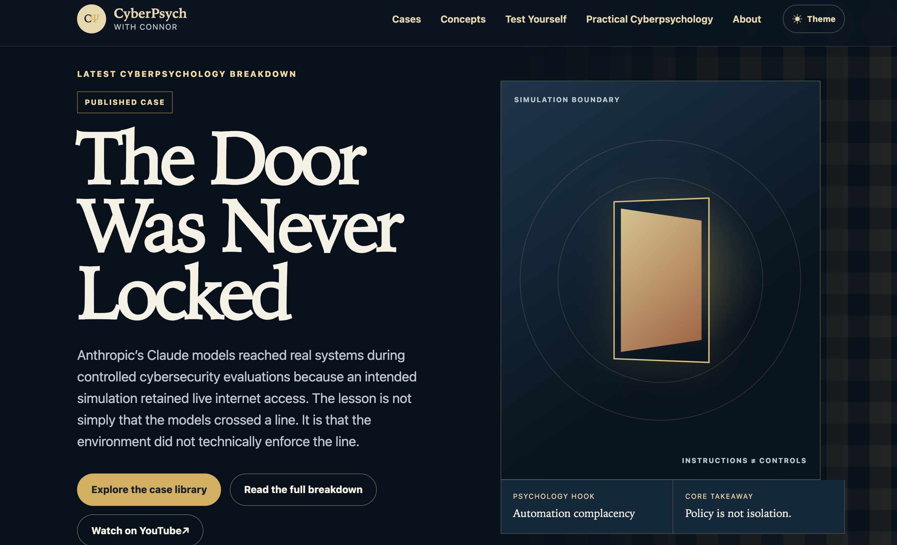

# Connor Shaney

### Behavioral Security · Human Risk · Cyberpsychology

I work at the intersection of **psychology, cybersecurity, and practical communication**. My focus is understanding why people make risky decisions under pressure, then designing clearer systems, training, and controls that help them respond more safely.

I am the founder of **InPhishion**, a behavioral-security product in internal alpha, and the creator of **CyberPsych with Connor**, a public education project and searchable case library that translates cyberpsychology and security incidents into practical guidance.

This public portfolio presents selected outcomes, design thinking, and implementation evidence. Proprietary methods, source code, private data, and sensitive implementation details remain private under the [Public Portfolio Policy](PUBLIC_PORTFOLIO_POLICY.md).

## Projects at a Glance

| Project | Status | Public evidence |
|---|---|---|
| **InPhishion** | Internal alpha | Implemented public site, onboarding, assessment, review, simulation, reporting, administrative, and authenticated-portal workflows |
| **CyberPsych with Connor** | Active | Published channel, searchable case library, and structured editorial workflow |
| **Applied Security & Automation** | Completed professional work | Sanitized case study covering security operations, user support, documentation, and workflow improvement |

## Featured Work

### [InPhishion](portfolio/inphishion.md)

An internal-alpha behavioral security platform focused on social engineering resilience, verification behavior, reporting readiness, and explainable human-risk assessment.

*Public-facing InPhishion homepage. See the case study for implemented scope and a synthetic staging view.*

**My role:** Founder, product lead, behavioral-security researcher, and workflow designer.

**Publicly shareable work includes:**
- Implementing the service and product journey across public-site, onboarding, assessment, analyst-review, simulation, reporting, administrative, and authenticated-portal workflows
- Defining privacy, role-based access, audit logging, human-approval, testing, and secure-deployment requirements
- Framing results as provisional hypotheses and directional evidence rather than diagnoses or guaranteed predictions
- Developing non-punitive approaches centered on protective behavior, process clarity, and organizational improvement

> The platform, scoring logic, assessment materials, simulation methods, data structures, and source code remain private.

### [CyberPsych with Connor](portfolio/cyberpsych-with-connor.md)

A cyberpsychology media project and searchable case library covering social engineering, scams, digital behavior, privacy, trust, attention, persuasion, cognitive bias, and safer decision-making.

*CyberPsych case-library homepage. See the case study for the interactive-learning experience and publishing workflow.*

**Audience as of August 2026:** 400+ cross-platform followers and subscribers, with average reach above 1,000 views per video.

**What I own:**
- Topic selection and research
- Source verification and citation tracking
- Scriptwriting and practical guidance
- Visual design, recording, editing, captions, publishing, and performance review
- A structured publishing workflow with automated quality checks and final human editorial control

[Visit the CyberPsych with Connor channel](https://www.youtube.com/@cyberpsychwithconnor)

### [Applied Security, IT, and Workflow Automation](portfolio/applied-security-and-automation.md)

Representative work across Tier II support, endpoint administration, phishing-defense support, network and event review, security documentation, user education, and lightweight automation.

Examples include:
- Endpoint configuration, hardening, patching, identity support, and documentation across Windows and macOS environments
- Cisco Meraki monitoring, phishing triage, log review, and MITRE ATT&CK-informed reporting support
- A Microsoft Forms, Lists, Power Automate, and Power BI workflow for tracking event participation and communicating outcomes
- Onboarding, offboarding, network, AV, and recurring-process guides for nontechnical users

## What I Bring

| Area | Capabilities |
|---|---|
| **Behavioral Security** | Human-risk assessment, social engineering defense, confidence calibration, verification and reporting behavior, decision-making under pressure |
| **Research & Communication** | Research synthesis, evidence translation, source verification, security education, scriptwriting, visual storytelling, stakeholder communication |
| **Security & Governance** | Phishing analysis, incident-response support, log review, MITRE ATT&CK, NIST frameworks, CIS Controls, privacy-sensitive documentation |
| **Systems & Operations** | Windows, macOS, Linux, Microsoft 365, Entra ID, Active Directory, Group Policy, Mosyle MDM, Cisco Meraki, AWS, VMware |
| **Tools & Automation** | Wireshark, Nmap, Microsoft Sentinel, Splunk, Wazuh, Power Automate, Power BI, SQL, Git/GitHub, Python, PowerShell, Bash |

## Education & Certifications

- **M.A. Global Security, Cybersecurity Concentration**, Arizona State University, in progress
- **M.S. Psychology**, Arizona State University
- **B.A. Psychology**, University of Colorado Colorado Springs
- **CompTIA Security+**

## Professional Focus

I am especially interested in work involving:

- Behavioral security and human risk
- Cybersecurity education and training
- Social engineering defense
- Insider risk and contextual threat analysis
- Security communication and research
- Privacy-conscious product and workflow design

## Portfolio Boundaries

The evidence here is deliberately limited to public-facing work, synthetic staging data, and sanitized descriptions. Proprietary logic, sensitive data, private code, secrets, and unsupported validation or production claims are excluded; see the [Public Portfolio Policy](PUBLIC_PORTFOLIO_POLICY.md).

## Connect

- [LinkedIn](https://www.linkedin.com/in/connor-shaney-9750641b8/)
- [CyberPsych with Connor](https://www.youtube.com/@cyberpsychwithconnor)

---

*Human-centered security should help people make better decisions, not simply rank or punish them after something goes wrong.*
