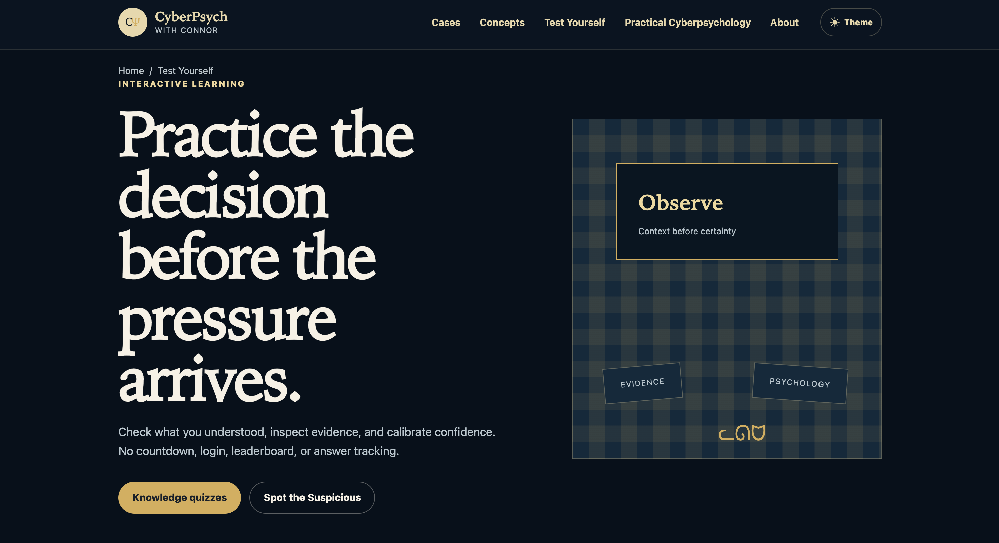

# CyberPsych with Connor

**Cyberpsychology education · Security communication · Practical guidance**

[Visit the website](https://cyberpsychwithconnor.com) · [Watch on YouTube](https://www.youtube.com/@cyberpsychwithconnor) · [Join the Briefing](https://cyberpsychwithconnor.com/newsletter)

[Back to portfolio](README.md) · [Back to profile](../README.md)

## Overview

CyberPsych with Connor is an independent public education project with a live website, YouTube channel, searchable case and concept libraries, interactive learning, and The CyberPsych Briefing newsletter. It explains how psychology, human behavior, and digital systems interact, with practical guidance for curious people, educators, and security practitioners.

Videos introduce the story. The website provides sources, deeper analysis, related psychology concepts, quizzes, and protective habits readers can use. The goal is to make security incidents and behavioral concepts understandable without relying on fear, hacker clichés, or unnecessary technical jargon.

Topics include social engineering, scams, privacy, persuasion, cognitive bias, attention, decision fatigue, trust cues, reporting behavior, AI-assisted deception, and practical ways people can interrupt risky decisions.

*The live website connects public education content with sourced incident analysis, psychology concepts, and interactive learning.*

**Audience as of August 2026:** 400+ cross-platform followers and subscribers, with average reach above 1,000 views per video.

## My Role

I created the project and manage the full content lifecycle:

- Identifying timely and useful topics
- Reviewing primary and reputable sources
- Tracking citations and separating verified facts from interpretation
- Connecting incidents to relevant psychological concepts
- Writing scripts and practical recommendations
- Designing supporting visuals and thumbnails
- Recording, editing, captioning, publishing, and reviewing performance
- Designing and building the website, case and concept libraries, quizzes, and practice activities
- Preparing The CyberPsych Briefing and connecting each issue to supporting site content
- Using AI-assisted tools for research, outlining, and production while retaining human validation and final editorial control

## Publishing Platform

I designed and built the live [CyberPsych website](https://cyberpsychwithconnor.com) to connect security incidents with the human behavior behind them, clear limits on what the evidence shows, and practical protective actions.

| Public resource | What readers can do |
|---|---|
| [Case library](https://cyberpsychwithconnor.com/cases) | Browse incident breakdowns, check sources, and follow the practical takeaways |
| [Concept library](https://cyberpsychwithconnor.com/concepts) | Learn psychology concepts in plain language and connect them to cases |
| [Quizzes & Practice](https://cyberpsychwithconnor.com/test-yourself) | Test understanding and inspect simulated evidence through activities such as Spot the Suspicious |
| [The CyberPsych Briefing](https://cyberpsychwithconnor.com/newsletter) | Sign up for a free roundup of stories, concepts, quizzes, and useful next steps |
| [Patch Rundown archive](https://cyberpsychwithconnor.com/patch-rundown) | Review software-update summaries with source links |

The publishing workflow includes source verification, structured content, automated quality checks, production builds, and validation before release. Human review controls factual claims, editorial wording, and publication.

*Interactive-learning page showing the project beyond the landing page: evidence review, confidence calibration, and pressure-aware decision practice without accounts, leaderboards, or answer tracking.*

## Editorial Approach

### Start with the event

Each breakdown begins with a concrete incident, scam pattern, technology change, or everyday digital behavior.

### Explain why it works

The content then examines the human factors that make the situation effective or confusing, such as urgency, authority, social proof, familiarity, cognitive load, divided attention, or misplaced trust.

### End with practical action

The final section gives the audience a manageable protective behavior, verification habit, reporting step, or decision rule they can use outside the video.

## Recurring Content Formats

### Cyberpsychology Breakdown

The main video series connects a timely cybersecurity, scam, technology, privacy, or AI story to one central psychology concept and one memorable action viewers can use.

1. What happened and what is confirmed
2. How human or organizational behavior shaped the event
3. What the audience can do differently

### Practical Cybersecurity Shorts

A separate series teaches one useful cyber skill at a time, such as inspecting a suspicious link, reviewing account sessions, or checking app permissions. Each short focuses on a concrete task viewers can apply in everyday life.

### Psychology concepts and interactive learning

Concept guides, knowledge quizzes, and simulated evidence exercises help readers apply the lessons beyond a single video. Activities encourage careful verification, attention to context, and realistic protective decisions.

### The CyberPsych Briefing

A free newsletter designed for about five minutes of reading every two weeks. Each issue brings together a featured case, the psychology behind it, one practical takeaway, short updates on other stories and common patches, and a quiz or challenge. Sources and deeper dives stay one click away.

[Signup is open](https://cyberpsychwithconnor.com/newsletter). Subscriptions become active only after readers confirm their email address.

## Skills Demonstrated

- Cyberpsychology and social engineering research
- Source verification and citation management
- Security awareness and public education
- Plain-language technical communication
- Scriptwriting and instructional design
- Video production and visual storytelling
- Educational website and interactive-learning design
- Newsletter writing and content curation
- Audience-focused editing
- AI-assisted workflows with human review
- Consistent editorial and publishing processes

## Communication Principles

- Calm rather than alarmist
- Accurate rather than sensational
- Practical rather than abstract
- Human rather than punitive
- Accessible without oversimplifying
- Transparent about uncertainty
- Selective about personal and sensitive information

## Portfolio Boundary

This case study shows the public-facing workflow and communication approach. It does not include unpublished scripts, private analytics, account credentials, subscriber information, private research notes, copyrighted third-party media, or material that would compromise another project or organization.
