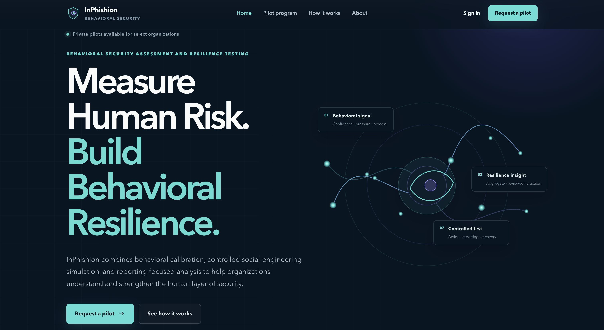
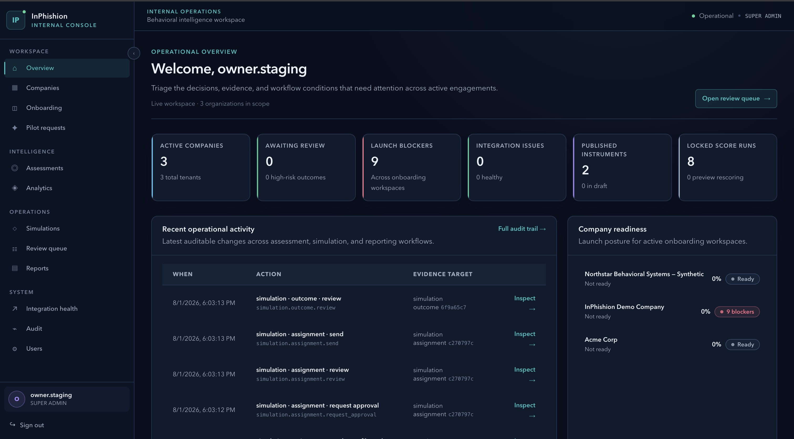

# InPhishion

**Behavioral security · Human risk · Social engineering resilience**

[Back to portfolio](README.md) · [Back to profile](../README.md)

[Website](https://inphishion.com) · [About InPhishion](https://inphishion.com/about) · [How it works](https://inphishion.com/how-it-works) · [Pilot program](https://inphishion.com/pilot) · [Contact](https://inphishion.com/contact)

## Overview

InPhishion is a behavioral security platform focused on helping organizations understand how people handle suspicious requests and what would make a safer response easier. It looks at verification, reporting, recovery, and the processes that support those decisions.

The approach connects two short assessments with analyst review, an authorized phishing exercise, group findings, and practical recommendations. Cyberpsychology helps frame questions about pressure, trust, confidence, and the demands of the workday. Findings remain provisional and tied to what was actually observed.

**Current stage:** The public website and authenticated application are live. InPhishion is preparing controlled pilot engagements with select organizations; the behavioral model is still being tested.

*Earlier public homepage view. The [live website](https://inphishion.com) has current wording and pilot information.*

## My Role

I founded InPhishion and lead its behavioral-security concept, product direction, service design, research framing, workflow specifications, and public communication.

My responsibilities include:

- Defining the problem space and the journey from pilot inquiry through findings and follow-up
- Translating behavioral concepts into structured, explainable product requirements
- Designing workflows for organization setup, assessment campaigns, analyst review, approved exercises, aggregate reporting, and debrief
- Establishing privacy, access-control, auditability, human-approval, and secure-deployment requirements
- Directing development while maintaining separation between product logic, public materials, and sensitive implementation details
- Reviewing language to avoid diagnostic certainty, punitive ranking, or unsupported prediction claims

## Implemented Product Scope

The deployed website and application include public-site, onboarding, assessment, analyst-review, simulation-approval, reporting, administrative, and authenticated-portal workflows. Current work focuses on pilot readiness, usability, and careful verification of live workflows.

Implementation and public availability do not mean every planned capability is ready for wider use. Exercise delivery remains subject to review, authorization, and an agreed scope. Public individual enrollment and paid checkout are not open, and no scientific validation or measured customer outcomes are claimed.

*Earlier internal-alpha console shown with synthetic staging data, retained as design evidence. It is not a current customer or live operational view. Proprietary assessment content, scoring logic, simulation materials, and customer information are not displayed.*

## Public-Safe Technology Summary

The product combines a deployed full-stack web application, authenticated and administrative interfaces, structured data and reporting workflows, and automated testing and quality checks. Architecture, configuration, data models, and behavioral logic remain private.

## Problem Space

Traditional awareness programs can overfocus on whether someone clicked a link while missing the wider context:

- Did the person pause and verify?
- Did they know how and where to report?
- Was the internal process clear enough to support a safe response?
- Did pressure, authority, urgency, or workload shape the decision?
- Did the organization reinforce protective behavior after the event?

InPhishion examines behavior, context, process, and response together so a finding can lead to a useful action.

## Publicly Shareable Product Approach

### 1. Structured assessment

Two short assessments gather directional evidence about security-relevant habits and decisions. Findings are treated as provisional hypotheses for review, not diagnoses or fixed labels.

### 2. Analyst-reviewed recommendations

Recommendations are designed to remain explainable and subject to human judgment. Automated output should support analysis, not replace accountability or professional review.

### 3. Safe, controlled simulations

Exercises require written authorization, defined limits, and review of the exact scenario before delivery. Each scenario centers on one believable situation and one primary action. No real credentials are collected. Public examples use fictional or organization-owned contexts; real-brand mimicry, clone domains, spoof-style identities, and cloned login pages remain outside this portfolio's scope.

### 4. Aggregate and privacy-conscious reporting

Reporting emphasizes group patterns, process gaps, protective behavior, and improvement opportunities. Findings explain the expectation, observation, interpretation and limits, and next useful action. Confirmed reporting behavior depends on an approved reporting connection and cannot be inferred from a click alone. Results are not used to rank employees or support employment decisions.

### 5. Debrief-driven improvement

Findings should lead to clearer procedures, targeted education, safer verification habits, improved reporting readiness, and practical follow-up. A later retest can examine whether the observed patterns changed.

Read the public [pilot process](https://inphishion.com/how-it-works) and [responsible testing commitments](https://inphishion.com/responsible-testing).

## Design Principles

- **Human-centered:** Improve decisions and systems rather than assign blame
- **Non-punitive:** Reward protective actions and identify process friction
- **Explainable:** Connect findings to observable evidence and clear reasoning
- **Privacy-conscious:** Minimize exposure and keep access purpose-limited
- **Analyst-reviewed:** Preserve human oversight for meaningful conclusions
- **Cautious in claims:** Distinguish directional evidence from validated prediction
- **Safe by design:** Keep assessment and simulation practices controlled and ethical

## Skills Demonstrated

- Behavioral security and cyberpsychology research
- Human-risk and social engineering analysis
- Product strategy and requirements development
- Assessment and workflow design
- Privacy and access-control planning
- Security communication and stakeholder framing
- Human-in-the-loop system design
- Ethical review and risk-boundary definition

## Intentionally Not Public

This portfolio does not publish:

- Source code or private repository content
- Assessment questions or proprietary instruments
- Scoring, weighting, recommendation, or profiling logic
- Simulation templates, targeting criteria, or delivery methods
- Data models, internal architecture, deployment details, or secrets
- Real participant, employee, client, or organizational information
- Claims of validation, production deployment, or measured client outcomes that have not been established

## Status

**Status as of September 8, 2026: Live website and application; controlled pilot preparation.** Current pilots are intended for select organizations, with participation, timing, safeguards, measurement, and pricing agreed before work begins. The behavioral model remains provisional, and broader delivery readiness is still being verified. Public individual enrollment and paid checkout are not open.

[Explore the pilot program](https://inphishion.com/pilot) or [start a pilot conversation](https://inphishion.com/contact).
